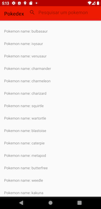

## Descrição Geral

Desafio tecnico da empresa B2W.

  

## Descrição técnica

### Resumo
Utilizei a arquitetura MVVM, com o uso de Interactors como ponte entre ViewModels (VM) e Repositório (`AppRepository`).
O `AppRepository` representa a abstração do fornecimnto dos dados que serão utilizados pela aplicação. Ele detem a política de decisão sobre como obter o dado. Parte dessa política está delegada ao `NetworkBoundResource`.
Os `Interactors` aplicam regras de negócio transformando os dados que serão utilizados pela `ViewModel`. Os `Interactors` estão padronizados (via `BaseInteractors`) para utilizarem, quando necessário, dos `Coroutines` para realização de suas tarefas assíncronas, como obter e transformar dados.
Apenas para a primeira tela (de listagem de pokemons) não se utilizou interactors, para diminuição da complexidade relacionada à uma solução de paginação.
Para a paginação, utilizou-se um conjunto de soluções do Android Architecture Components chamado Paging Library (https://developer.android.com/topic/libraries/architecture/paging)


### Principais BiBliotecas

- **Retrofit 2**: Para consultas http;

- **Room**: Para persistência simples de dados

- **Coroutines**: Para assincronicidade com melhor leitura de código (sem callbacks)

- **Android Architecture Components**: Utilização de Viewmodel e Livedata
  para exibir e manter os dados utilizados pela View de maneira segura
  com o ciclo de vida das Activities


## Testes

Os testes utilizam o buildtype ```instrumentation``` para funcionar, pois forçamos que o app seja buildado para apontar para localhost durante os testes.
Para Mac OS:
- Para testes unitários: usar o comando ```./gradlew testDebugUnitTest```
- Para testes instrumentados (unitários e de UI): usar o comando ``` ./gradlew connectedInstrumentationAndroidTest```

Nos demais sistemas operacionais: Utilizar comando equivalente

 utilizar o recurso de Talkback de um dispositivo Android físico.

## Itens não realizados

- Ao tocar em uma habilidade, exibir um modal com a descrição (por motivos de tempo)
- Ao tocar em um tipo, exibir a lista dos pokemons desse mesmo tipo (por motivos de tempo)
- Exibir a cadeia de evolução do Pokémon (por motivos de tempo)
- Exibir spinner (combobox) que permita selecionar as variações do Pokémon (ao selecionar uma variação, o app deve carregar automaticamente os dados da variação selecionada) (por motivos de tempo)
- Injeção de dependência
- Fim de scroll infinito (condição de parada) 
- Exibição de imagem dos pokemons na tela de listagens (explicação a seguir)
- Testes de UI (por motivos de tempo).
- Shared element transitions (sei fazer, mas não implementei por não mostrar a imagem na listagem inicial)

## Exibição da imagem de preview dos pokemons na listagem inicial

O endpoint da API responsável pela listagem dos pokemons não provê o url referente a uma imagem de preview de cada pokemon. O ideal seria, para fins de performance em mobile, que o endpoint já provesse as URLs.
Para contornar o problema, duas abordagens são possíveis:

- Ainda durante a obtenção da listagem, consultar cada item e baixar todas as informações (URL da imagem inclusive) de cada pokemon em outro endpoint. Ainda que salvemos tudo offline, a demora de carregamento seria demasiadamente grande e acarretaria consumo de dados e energia do celular desnecessários para uma simples listagem inicial, pois acaba-se baixando todas as informações de todos os pokemons que não necessáriamente serão exibidos de imediato.
- Uma outra abordagem seria, após obter a listagem, baixar as informações de cada pokemon que à medida que aparecessemna tela durante o scroll, num padrão [proxy](https://pt.wikipedia.org/wiki/Proxy_(padr%C3%B5es_de_projeto)#:~:text=O%20Padr%C3%A3o%20de%20Projeto%20Proxy,acesso%20distribu%C3%ADdo%2C%20controlado%20ou%20inteligente.). Esse padrão exigiria uma requisição http a nível de callbacks de criação de viewhoder. Isso exigiria uma solução técnica mais robusta, pois precisa levar em consideração o ciclo de vida do viewholder e da activity. O uso de viewmodel do Google para esse fim não é costumeiro. Portanto, esta abordagem exigiria maior esforço e tempo para implementação.

As duas abordagens acima são inviáveis para a intenção de realização de um desafio técnico em um prazo médio de 4 dias. A premissa do desafio, na minha opinião, é mostrar o _máximo_ de conhecimento técnico da plataforma no _menor_ tempo possível.

 